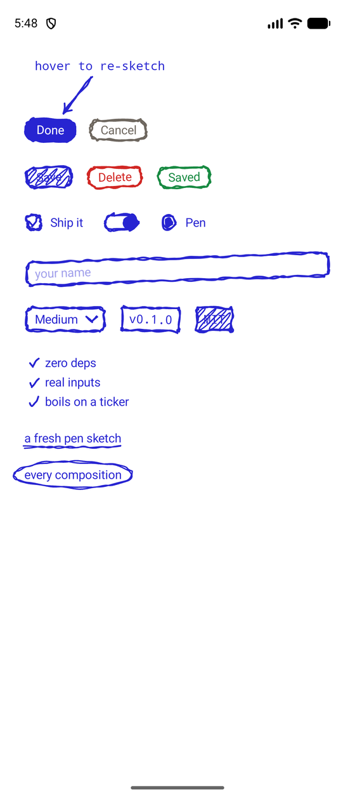
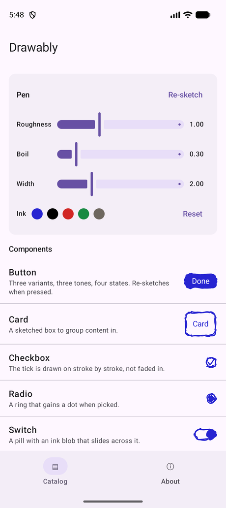
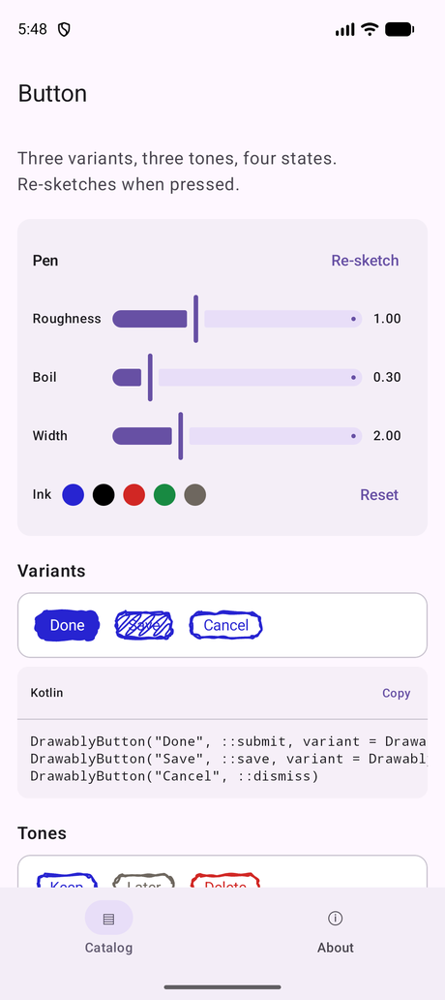

<div align="center">

# Drawably for Jetpack Compose

**A Jetpack Compose port of [Drawably](https://www.drawably.dev), the hand-drawn
UI library by [Daniel Belyi](https://github.com/Danilaa1), MIT licensed.**

Controls that sketch themselves fresh on every composition, boil gently while
idle, and re-sketch when you touch them.

[](https://github.com/dim971/drawably-android/actions/workflows/ci.yml)
[](https://kotlinlang.org)
[](#requirements)
[](#requirements)
[](LICENSE)



</div>

The design, the stroke engine and every control here are Daniel Belyi's work.
This repository ports them to Jetpack Compose: the engine is a direct
transcription of [`prng.ts` and `rough.ts`](https://github.com/Danilaa1/drawably),
checked against fixtures generated from the published npm package so that it
emits byte-identical geometry. See [Fidelity](#fidelity).

```kotlin
DrawablyButton("Done", onClick = ::submit, variant = DrawablyButtonVariant.Solid)
```

## Contents

- [Requirements](#requirements)
- [Installation](#installation)
- [Quick start](#quick-start)
- [Components](#components)
- [Theming](#theming)
- [Motion and accessibility](#motion-and-accessibility)
- [Fidelity](#fidelity)
- [Showcase app](#showcase-app)
- [Documentation](#documentation)
- [Contributing](#contributing)
- [Credits](#credits)
- [Licence](#licence)

## Requirements

minSdk 24, compileSdk 37, JDK 17 bytecode.

The library sits on **Compose Foundation, not Material**, so it drops into any
Compose app whatever design system it already uses, and brings nothing else with
it.

## Installation

```kotlin
dependencies {
    implementation("dev.drawably:drawably-compose:0.1.0")
}
```

```kotlin
import dev.drawably.compose.components.*
import dev.drawably.compose.theme.DrawablyTheme
```

## Quick start

```kotlin
@Composable
fun Example() {
    var agreed by remember { mutableStateOf(false) }
    var name by remember { mutableStateOf("") }

    DrawablyTheme {
        Column(verticalArrangement = Arrangement.spacedBy(16.dp)) {
            DrawablyTextField(name, { name = it }, placeholder = "your name")
            DrawablyCheckbox(agreed, { agreed = it }) { Text("Ship it") }
            DrawablyButton("Done", ::submit, variant = DrawablyButtonVariant.Solid)
        }
    }
}
```

## Components

All fifteen upstream controls, with upstream's defaults.

| Component | What it is |
| --- | --- |
| `DrawablyButton` | Three variants (`Outline`, `Solid`, `Scribble`), three tones (`Standard`, `Neutral`, `Danger`), four states (`Idle`, `Loading`, `Error`, `Success`). Re-sketches on press and hover, and washes its inside with its own ink: 18% pressed, 10% hovered. |
| `DrawablyCard` | A sketched box to group content in. |
| `DrawablyCheckbox` | The tick is drawn on stroke by stroke over 240ms. |
| `DrawablyRadioButton` | A ring that gains a dot when picked. |
| `DrawablySwitch` | A pill with an ink blob that slides across it. |
| `DrawablyTextField` | One line of text in a sketched box. |
| `DrawablyTextArea` | Several lines of it. |
| `DrawablySelect` | A pen chevron opening a sketched list, tailed back to the field, with no platform chrome around it. Pre-sized to the widest option so picking never shifts the layout. |
| `DrawablyDivider` | A pen line across the available width. |
| `DrawablyBadge` | A small sharp-cornered tag. `Outline` or `Scribble`. |
| `DrawablyList` | Bullets drawn in the gutter. `Dash` or `Check`. |
| `DrawablyDecoratedText` | `Underline`, `Highlight` or `Circle`, one mark per line the text wraps onto. |
| `Modifier.drawablyUnderline()` / `drawablyHighlight()` / `drawablyCircle()` | The same marks as a single box, for anything that is not text. |
| `DrawablyArrowLayer` + `Modifier.drawablyAnchor()` | A sketched arrow between two named anchors. |
| `Modifier.drawablyTilt()` | Leans a control a couple of degrees, so a group looks laid out by hand. Seeded, so it is stable, and the same seed leans the same way on iOS. |

Full reference: [docs/components.md](docs/components.md).

## Theming

`DrawablyTheme` mirrors upstream's CSS custom properties, defaults included, and
travels through a `CompositionLocal` the way they cascade.

| Property | Default | What it does |
| --- | --- | --- |
| `stroke` | `#2724d1` | Line colour |
| `fill` | `#2724d1` | Filled layers: a solid button's blob, a radio's dot, a highlight's wash |
| `paper` | white | What the ink sits on; a solid button's label is drawn in it |
| `width` | `2.dp` | Stroke width for ordinary layers |
| `error` / `success` | `#d12724` / `#188a42` | Semantic ink |
| `roughness` | `1.0` | Jitter amplitude of the base sketch |
| `boil` | `0.3` | Per-frame flicker amplitude; `0` renders a still sketch |

More in [docs/theming.md](docs/theming.md).

## Motion and accessibility

Upstream boils by stepping a CSS custom property through three pre-rendered
frames every 1200ms, and speeds that up to 450ms while a button is loading. The
same happens here on a ticker: three frames are generated once per box size,
seed and options, and the draw pass only picks which one to stroke.

Turning animations off (developer options, or accessibility settings) zeroes
`ANIMATOR_DURATION_SCALE`, which stops the boil and the re-sketch, the same way
`prefers-reduced-motion` does upstream.

Every control wraps a real Foundation control (`toggleable`, `selectable`,
`BasicTextField`), so TalkBack, focus and keyboard behave as they would without
the sketch, which is drawn behind and carries no semantics.

## Fidelity

Every shape is generated by a direct port of upstream's `prng.ts` and
`rough.ts`. The unit tests replay fixtures produced by the published npm package
and assert the ported engine emits **byte-identical** path data: the same PRNG
stream, the same sample counts, the same boil frames, for all 26 control layers.

Getting there needed three deliberate JVM/JavaScript reconciliations, all
explained in [docs/fidelity.md](docs/fidelity.md).

## Showcase app

A catalog app listing every component with a live preview, a screen per
component showing its variants with copyable code, and pen controls on every
screen so you can feel roughness, boil, width and ink.

<p align="center">
  
  
</p>

```sh
./gradlew :showcase:installDebug
```

In Android Studio, open the project and pick the **showcase** run configuration.
It is checked in, so the app is launchable straight after cloning.

## Documentation

| Document | What it covers |
| --- | --- |
| [Getting started](docs/getting-started.md) | Installing, the first control, common patterns |
| [Components](docs/components.md) | Every component, its parameters and its behaviour |
| [Theming](docs/theming.md) | The theme, seeds, and drawing your own shapes |
| [Fidelity](docs/fidelity.md) | How the port is verified against the original |
| [Architecture](docs/architecture.md) | How a sketch gets from the engine to the screen |
| [Coding style](docs/coding-style.md) | The Kotlin conventions as they apply here, and where we differ |

The build enforces the mechanical half: `./gradlew ktlintCheck` for the coding
conventions, explicit API mode for the library rules, and `./gradlew lint` for
Android correctness.

## Contributing

Issues and pull requests are welcome. See [CONTRIBUTING.md](CONTRIBUTING.md)
for how to build, test and what the review looks for. Everyone taking part is
expected to follow the [Code of Conduct](CODE_OF_CONDUCT.md).

## Credits

**[Drawably](https://www.drawably.dev) is by [Daniel Belyi](https://github.com/Danilaa1)**.
The idea, the stroke engine, the components and the look are his.
[`Danilaa1/drawably`](https://github.com/Danilaa1/drawably) is the original, and
worth reading: the whole renderer is 166 lines.

This repository is a port. It contributes a Kotlin transcription, the fixtures
that keep it honest, and the Compose plumbing around it.

## Licence

MIT. See [LICENSE](LICENSE). Upstream Drawably is © 2026 Daniel Belyi, also
MIT; [NOTICE](NOTICE) records the attribution in full.
