# Components

Every control takes an optional `seed`; see [theming.md](theming.md#seeds).

## Button

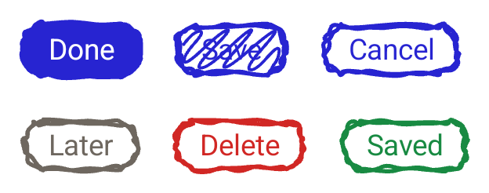

```kotlin
DrawablyButton("Done", ::submit, variant = DrawablyButtonVariant.Solid)
DrawablyButton(onClick = ::submit) { DrawablyText("Done") }
```

| Parameter | Values | Default |
| --- | --- | --- |
| `variant` | `Outline`, `Solid`, `Scribble` | `Outline` |
| `tone` | `Standard`, `Neutral`, `Danger` | `Standard` |
| `state` | `Idle`, `Loading`, `Error`, `Success` | `Idle` |

- `Solid` fills the box with an ink blob and draws the label in `paper`.
- `Scribble` hatches it at a fixed 45°.
- `Neutral` is a warm grey, `Danger` the theme's `error`.
- A state recolours the ink without touching the theme. `Loading` also dims the
  button, stops it responding, and boils at 450ms instead of 1200ms.
- Pressing lifts the outline to 1.4× its width, sinks the button, and washes its
  inside with 18% ink; hovering washes at 10%. A solid button is skipped: it is
  already filled.

## Card

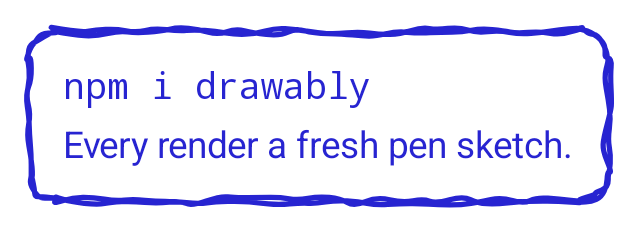

```kotlin
DrawablyCard { DrawablyText("npm i drawably") }
```

A sketched box with 16dp of padding.

## Checkbox

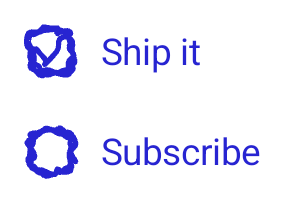

```kotlin
DrawablyCheckbox(agreed, { agreed = it }) { DrawablyText("Ship it") }
DrawablyCheckbox(agreed, { agreed = it })          // the box on its own
```

22dp square, `Role.Checkbox`. The tick is *drawn on* over 240ms rather than
faded in. Upstream animates `stroke-dashoffset`, this trims the path.

## Radio button


```kotlin
DrawablyRadioButton(tool == Pen, { tool = Pen }) { DrawablyText("Pen") }
```

22dp square, `Role.RadioButton`. The dot pops in from half size.

## Switch

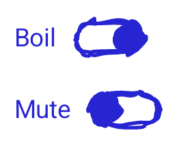

```kotlin
DrawablySwitch(boiling, { boiling = it }) { DrawablyText("Boil") }
```

44×24dp, `Role.Switch`. The knob slides the pill's width less its height, so it
lands centred at either end.

## Text field and text area

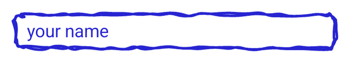
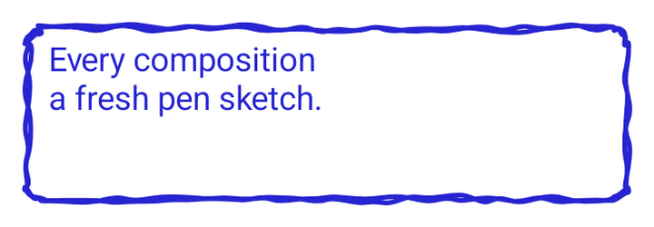

```kotlin
DrawablyTextField(name, { name = it }, placeholder = "your name")
DrawablyTextArea(notes, { notes = it }, minHeight = 96.dp)
```

Real `BasicTextField`s inside the shared sketched box, with the focus ring shown
on focus. Neither re-sketches on hover, matching upstream.

## Select

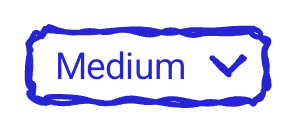
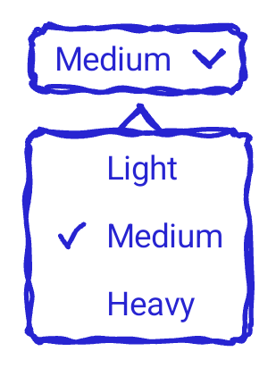

```kotlin
DrawablySelect(weight, listOf("Light", "Medium", "Heavy"), { weight = it })
```

A sketched box with a pen chevron. Every option is laid out invisibly under the
chosen one, so the box is already as wide as the widest and picking never shifts
the layout around it.

Opening it shows a sketched list centred underneath, with a pen tail pointing
back at the field and a tick beside the chosen option. It is positioned by a
`PopupPositionProvider` rather than left to the platform, so the tail always
points at something. A tap anywhere else closes it.

## Divider

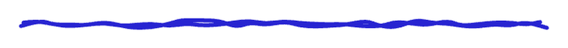

```kotlin
DrawablyDivider()
```

A pen line across the available width, in a 10dp-tall box.

## Progress

**This control has no upstream counterpart.** Drawably has no progress
indicator; this one is added by the port, drawn with the same engine and the
same conventions as the rest. Its geometry is therefore not pinned by a golden
fixture, because there is nothing upstream to pin it against.

```kotlin
DrawablyProgress(step = 3, total = 7)
```

A row of boxes, `total` of them, with the first `step` hatched. Both arguments
are clamped: a step past the end fills the track, a negative one empties it, and
a total below one still draws one box.

Each box is drawn from its own seed, offset from the track's. Sharing one seed
would draw the same rectangle seven times over, which reads as a printed rule
rather than as a hand.

A box is 34dp wide at most, not exactly. Boxes share the width the row has and
shrink when there are more of them than fit, so a track of twelve steps on a
phone stays inside the screen instead of pushing what is beside it off the edge.
A track with room to spare looks exactly as it did.

The other overload takes a fraction, the way `LinearProgressIndicator` does:

```kotlin
DrawablyProgress(progress = { 0.42f }, steps = 10)
```

| Parameter | Values | Default |
| --- | --- | --- |
| `steps` | how many boxes the track has | `10` |
| `seed` | pins the track, and every box in it | `null` |

`progress` is a lambda so a moving value redraws without regenerating the
track's geometry. A fraction that is not a finite number draws an empty track:
it says nothing about how far along the work is, and the control does not
guess.

The track carries `ProgressBarRangeInfo`, so TalkBack reads it out as progress
with the right step count.

## Badge

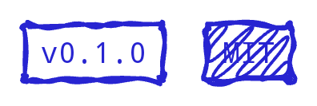

```kotlin
DrawablyBadge { DrawablyText("v0.1.0") }
DrawablyBadge(variant = DrawablyBadgeVariant.Scribble) { DrawablyText("MIT") }
```

A tight sharp-cornered tag. Its padding is derived from the theme, not fixed, so
the label stays clear of the outline however thick or rough the pen gets.

## List

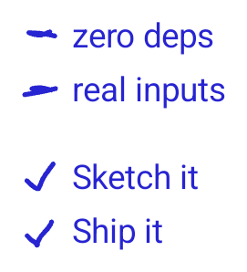

```kotlin
DrawablyList(steps, marker = DrawablyListMarker.Check) { step ->
    DrawablyText(step)
}
```

Markers are drawn in the 24dp leading gutter, each row seeded by its index.

## Text decorations

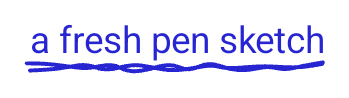
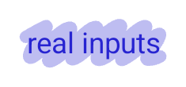
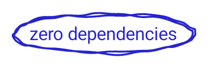

```kotlin
DrawablyDecoratedText("a fresh pen sketch", DrawablyDecoration.Underline)
```

Marks every line the run wraps onto, straight from the `TextLayoutResult`, the
Compose equivalent of upstream's `getClientRects()`. For anything that is not
text, `Modifier.drawablyUnderline()`, `drawablyHighlight()` and
`drawablyCircle()` mark the whole box. They draw at 1.5dp rather than the
control default of 2: body copy is thinner than chrome.

## Arrow

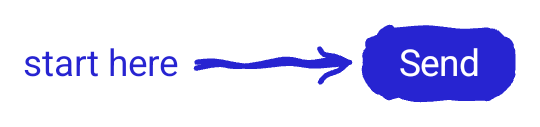

```kotlin
DrawablyArrowLayer(arrows = listOf(DrawablyArrow("hint", "send"))) {
    DrawablyText("start here", modifier = Modifier.drawablyAnchor("hint"))
    DrawablyButton("Send", {}, modifier = Modifier.drawablyAnchor("send"))
}
```

Anchors resolve against the layer, so they do not drift when the content
scrolls. The arrow runs centre to centre, pulled back to each box's edge plus a
little clearance.

## Tilt

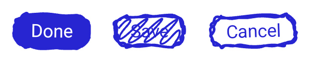

```kotlin
DrawablyButton("Done", {}, modifier = Modifier.drawablyTilt())
DrawablyCard(modifier = Modifier.drawablyTilt(degrees = -1.5f)) { … }
```

A small lean, so a group of controls looks laid out by hand. The seeded angle
comes from the same PRNG the sketches do, so a given seed leans the same way
here as on iOS. It is picked once and held: a control that shifted every time it
re-sketched would be unusable. It does not affect layout.
